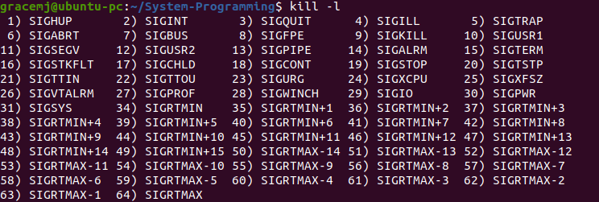
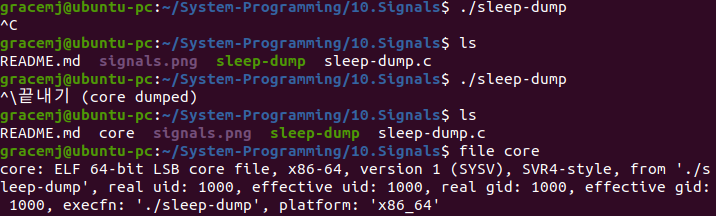

# Signals
### Signal 
- a software interrupt
- delivered to a process as an __asynchronous event__
- to represent __events__ of a system  

|Events|Types of Signals|
|---|---|
|generated by USERS through the TERMINAL|__SIGINT__(^C), __SIGSTOP__(^Z)|
|due to HARDWARE FAULTS|__SIGSEGV__, __SIGBUS__|
|due to ANOMALOUS(이례적인) SW conditions|__SIGPIPE__, __SIGURG__, __SIGALRM__|

### Signal Processing Model
- follows the push model
- Process declares its interest in listening for an event(= signal) by registering a __handler__ that will be called as soon as the event occurs
- Handler passes all info associated to the signal
- Program execution usually resumes upon a handler termination

### Signal Reputation
- Bad reputation due to a few unreliability causes in signal delivery
- Bad specifications, implementations and expressiveness in early *nix System
- But now it's reliable

### SIGNAL
- Signal names: starting with __SIG__
- _signal.h_: matches signal names to signal numbers  

### Signal disposition
- Signal은 비동기적인 이벤트 → 언제 일어날지 예상X → 시그널이 발생했을 때 수행해야할 부분 마련해서 커널에 알려야 함
- 이것이 바로 kernel에 register하는 __Signal Disposition (처리)__

|시그널 처리 방법|설명|
|---|---|
|Ignore the signal|nothing happend, the event is ignored|
|Catch the signal|specific handler is executed when the event to the signal occurs|
|Default|Termination of the process OR Termination of the process and dump core OR Ignore the signal OR Stop or resume process execution|

### Signal delivery and handler execution

### Signal life cycle
- Signal is generated for a process (or sent to a process) when the corresponding event occurs
- Signal remains __pending (지연)__ between generation and delivery  

- Process can block signal delivery
  - Each process has __signal mask__ (= a set of signals blocked by the process)
  - If a blocked signal is generated and its disposition is either default or catch, the signal remains pending until either of
    - process unblocks the signal
    - process changes disposition to ignore the signal
- Decision of what to do with a signal is taken when the signal is delivered, not when it is generated

### Notable Signals
__1. Process-related events__

|Signals|#|default|action|
|---|---|---|---|
|__SIGABRT__|6|terminate and core|generated by calling the abort function|
|__SIGALRM__|14|terminate|generated at the expiration of a timer set by the alarm function|
|__SIGCHLD__|17|ignore|sent to the parent process upon the termination of a child|
|__SIGURG__|23|ignore|notification of some urgent conditions|

__2. Job control__

|Signals|#|default|action|
|---|---|---|---|
|__SIGSTOP__|19|stop process|sent to a process to suspend its execution (cannot be ignored or caught)|
|__SIGCONT__|18|resume the process if stopped; ignore otherwise|sent to a process just after it resumes the exeuction (used to redraw the terminal upon restart)|

__3. Terminal events__

|Signals|#|default|action|
|---|---|---|---|
|__SIGHUP__|1|terminate, mnemonic: Hang UP|sent to a session leader process when the controlling terminal is disconnected|
|__SIGINT__|2|terminate|terminal character to request termination of all foreground processes (ctrl+C)|
|__SIGQUIT__|3|terminate and core|same as SIGINT, but request to dump core (ctrl+\)|
|__SIGSTP__|20|stop process, mnemonic|(Terminal SToP) request top of all foreground processes (ctrl+Z)|
|__SIGTTIN__|21|stop process, mnemonic|(Terminal Try INput) sent to a background process if it attempts to read from its controlling terminal|
|__SIGTTOU__|22|stop process, mnemonic|(Terminal Try OUtput) dual to SIGTTIN, sent to a background process if it attempts to write to its controlling terminal|

__4. Hardware faults__

|Signals|#|default|action|
|---|---|---|---|
|__SIGBUS__|7|terminate and core|sent to a process that causes bus errors (ex. unaligned memory access)|
|__SIGSEGV__|11|terminate and core|sent to a process that cuases a SEGmentation Violation (or segmentation fault - access to memory with no rights)|
|__SIGFPE__|8|terminate and core|invalid floating point arithmetic operation (ex. divide by 0)|
|__SIGILL__|4|terminate and core|sent to a process that attempt to execute an illegal instruction (ex. malformed assembly instruction)|

__5. Software faults__

|Signals|#|default|action|
|---|---|---|---|
|__SIGPIPE__|13|terminate|sent to a process if it attempts to write to a connected process-to-process IPC facility that has no connected readers (Pipe, socket, etc.)|

__6. Custom events__

|Signals|#|default|action|
|---|---|---|---|
|__SIGUSR1__|10|terminate|handling semantics that custom signal handlers might assign to it (for user's own signals)|
|__SIGUSR2__|12|terminate|handling semantics that custom signal handlers might assign to it (for user's own signals)|

__7. Real-time signals__

## Core Dump
- = Core File
- an image of the memory of a process, taken at the _crash-time_ of the corresponding process
- has useful information to debug the crash
  - Memory dump at the time of crash
  - Termination status (usually abnormal)
  - Copies of processor registries
- Default disposition of many signals inclues core dumps ∵ many default setups set to 0 the maximum size limit on core dumps
  - _ulimit -c_: check out the current setting
  - _ulimit -c unlimited_: enabling core files
~~~
gcc -Wall -g -o sleep-dump sleep-dump.c
./sleep-dump
ctrl+c    // sending SIGINT = terminate with no core
ctrl+\    // sending SIGQUIT = terminate with core
gdb sleep-dump core       // it shows 'Program terminated with signal SIGQUIT, Quit.'
~~~

### Old Style Signaling: _signal()_
~~~
typedef void (*sighandler_t)(int);
sighandler_t signal(int signo, sighandler_t handler);
  Returns: previous signal disposition if OK, SIG_ERR on error
~~~
__signo__: the name (or number) of signal whose disposition we want to change
__handler__: one of the followings:
  - ___SIG_IGN___ to request ignoring of __signo__
  - ___SIG_DFL___ to reset the signal disposition of __signo__ to the default
  - point to the handler that is invoked to complete a signal delivery passing the number of the signal being delivered
  
~~~
gcc signal1.c -o signal1
kill -10 [process ID]   // 10) SIGUSR1
kill -12 [process ID]   // 12) SIGUSR2
~~~

## Signal Inheritance
### fork()
- a child inherits parent's signal disposition
  - ignored and default signals remain the same in the child
  - caught signals continue to be caught by the same handlers
### exec()
- ignored and default signals can remain the same, but caught signals cannot because function pointers would be meaningless in the address space of a new (different) program
- __exec()__ resets to the default actions for caught signals

~~~
#include <signal.h>
int kill (pid_t pid, int signo);
int raise (int signo);
  Returns: 0 if OK, -1 on error
~~~
Signals can be sent to arbitrary processes using _kill()_ or to the current process using _raise()_
For _kill()_, the meaning of __pid__ depends on:
- __pid > 0__: signal sent to process with _pid_
- __pid == 0__: signal sent to all processes in the same process group of the sender
- __pid < 0__: signal sent to all processes of process group _abs(pid)_
- __pid == -1__: signal sent to all processes

Appropriate permissions are required to send a signal
- Superuser (process) can kill arbitrary processes
- Normal user (process) can kill processes whose real or saved set-user-ID are equal to the sender process real or effective uid

## Signal Pause: _pause()_
It blocks a process until a signal is caught (i.e., activating a signal handler)
~~~
#include <unistd.h>
int pause(void);
  Returns: -1 with errno set to EINTR
~~~

## Signal Alarm: _alarm()_
It sets a timer for a aprocess that will expire seconds in the future; after the timer expiration, __SIGALRM__ is sent to the calling process
~~~
#include <unistd.h>
unsigned int alarm(unsigned int seconds);
  Returns: 0 or number of seconds until previously set alarm
~~~
- Default action is a process termination
- One timer per process is set (i.e., no more than one timer)
- __alarm(0)__ cancels the timer
- number of seconds left before the previous timer expiration is returned at each invocation
~~~
gcc clock.c -o clock
./clock
~~~

## Signal Sleep: _sleep()_
It is a timeout-powered version of _pause()_
~~~
#include <unistd.h>
unsigned int sleep(unsigned int seconds);
  Returns: 0 or number of unslept seconds
~~~
Signal is caught and its signal handler returns  
Return value tells us the remaining time, in seconds, until termination condition

### Reliability Issues with _signal()_
1. Reset to default
  - Action dispositions used to be reset to the default action at each delivery; code like the following was (and still is) common place
~~~
void my_handler(int signo){
...
  signal(SIGINT, my_handler);   // re-establish handler
...                             // process signal
}

int main(void){
...
  signal(SIGINT, my_handler);   // establish handler
}
~~~
  - Problem: Race condition between the start of handler execution and the re-establishmnet of the signal handler
  - Signal delivered in between will trigger the default action (i.e., potentially terminating the process)
  
2. Snoozing signals
  - Alternate program phases where we can't be interrupted (i.e., critical regions), with phases where we can, without losing relevant signals delivered during the critical regions
~~~
int sig_int_flag = 0;   // global flag

void my_handler(int signo){
...
  signal(SIGINT, my_handler);   // establish handler
  sig_int_flag = 1;             // caught signal and set flag
}

int main(void){
...
  signal(SIGINT, my_handler);
...
  while(sig_int_flag == 0)
    pause();
...
}
~~~
  - When the signal handler returns, the program will be awakened (thanks to _pause()_) and the flag will tell us if a specific handler has been executed
  - If the signal is not relevant, wait for the signal
  - Problem: Race condition between the test of _sig_int_flag == 0_ and _pause()_
  - If a signal gets delivered in that window (and if it's delivered only once), the pgoram will block forever because nobody will (re)check the flag before blocking
  - Mitigation: use _sleep()_ instead of _pause()_: but it still induces timeout and/or polling problems
  
3. __EINTR__ uncertainty 
  - System calls invocations can be classified in two classes: slow and fast invocations
  - Slow invocations might block indefinitely
    - _read()_, _write()_, and _ioctl()_ when called on slow devices
    - _wait()_, _waitpid()_
    - socket interfaces
    - file locking interfaces
    - IPC synchronization primitives such as message queues, semaphores, mutexes, etc.
  - If a signal gets caught during a slow system call invocation, the system call might return an error and set EINTR to errno
  - Merit of interrupt-able system calls is that they allow to have a way out of situations that could block forever
  - Demerit of interrupt-able system calls is that the code needs to deal with the _EINTR_ error condition explicitly and restart the interrupted system call invocation, like the following code
~~~
while ((n = read(fd, buf, BUFFSIZE)) != 0){
  if (n == -1){
    if (errno == EINTR)
      continue;
    else
      // handle other error cases
  }
  // handle success cases
}
~~~

4. Signal queuing
  - Old style signaling, which is used by early Linix with _signal()_, has no way to handle the same signal generated twice, before the target process has a chance to deliver it.

5. Causality
  - What would be the delivery order of signals to a process if different signals are gnerated for the same target process in the order s1, s2, ... sn?
  - We cannot get any guarantee about the preservation of any order between the generation and delivery
