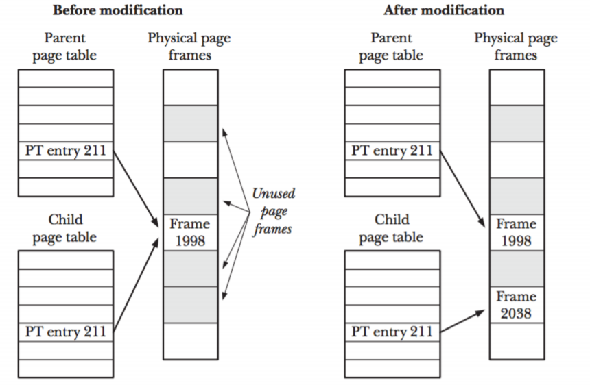

# Process Creation Practice

## Process ID
_getpid()_ show its own process ID (PID)
_getppid()_ show its parent process ID (PPID)
 - _init_, which is root process, has no parent process
 - system booting --> _init_ starts
 - _init_ itself is considered as a __kernel__
 - _systemd_ = process management daemon (used for zombie process)

## New Process
### _fork()_ function
It __creates__ new process by duplicating the existing process. (Otherwise, it would be slow and waste of RAM.)  
A new child process is the result of _fork()_, and it gets copies of data, heap and stack segments. (__Text segment__ is __shared__ with the parent)  
- if (return value > 0) we are on the __parent__ process
	- parent process knows child process's PID by the return value
- if (return value == 0) we are on the __child__ process
	- child process knows parent process's PID by _getpid()_
- if (return value == -1) there is an __error__
~~~
gcc fork.c -o fork
gcc fork2.c -o fork2
~~~
On executing _fork_, the child process's PPID is shown as 1506. You can see PID 1506 is __systemd__ by _ps -ef_.

#### Copy-on-Write (CoW)
When forked, initially all pages are __shared__ among the parent and child processes as mentioned. If either process __writes__ to these pages (or do editing on the shared resources), then __kernel copies the underlaying frame__ and __update the virtual memory mapping__ before returning.  
When forked, parent and child process are sharing physical RAM, not memory. Linux copies the memory(= same page tables), only when one of them tries to __write__.  
~~~
gcc cow.c -o cow
~~~
When a process tries to write to a shared memory address,
1. there's a __page fault__
	- __page fault__ happens when you try to access a page that's marked "not in memory"
	- "not in memory" usually means the data is on disk (not in RAM)
1. Linux makes a copy of the page (_read only_) and updates the page table
1. the process continues

### _exec()_ family function
They __replace__ current process image with a __new process image__.  
It loads the program into the current process space and executes the new process image from the entry point.
